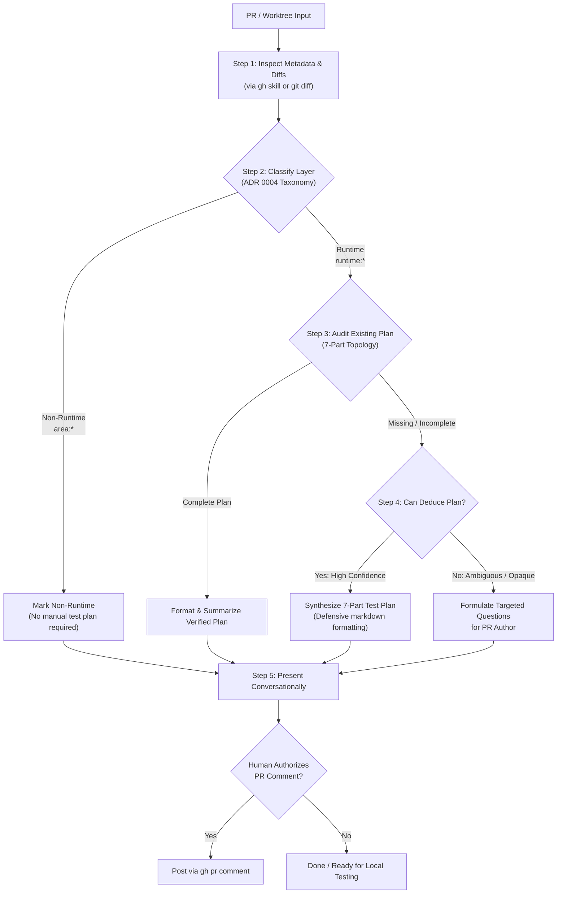

# Pull Request Experiment Test Plan Assistant (`pr-test-plan`)

This skill equips AI coding agents and human maintainers to evaluate incoming Pull Requests (or active feature worktrees) for participant and experimenter runtime changes, audit existing manual test instructions, and proactively synthesize Deliberate Lab's canonical **7-part manual experiment test plan**.

It bridges the gap between high-level code diffs and concrete local verification—eliminating the cognitive burden of reverse-engineering experiment configurations while maintaining strict testing discipline.

---

## When to use

Invoke this skill when:
- Reviewing an open PR: *"Does PR <id> need a test plan?"*, *"Evaluate PR <id> for testing"*, *"Review PR <id> test plan"*.
- Synthesizing verification steps: *"Draft a test plan for PR <id>"*, *"What manual test steps are needed for PR <id>?"*, *"Generate manual verification steps for this PR"*.
- Preparing to test locally: Pairing with [`eval-pr`](../eval-pr/SKILL.md) to understand how to configure and run an experiment before or after setting up a worktree.
- Authoring a PR: Creating a manual test plan for your own feature branch before opening a PR.

---

## Core Principles

### 1. The Co-Author Posture
Rather than acting as an asynchronous, blocking CI gatekeeper, this skill operates **interactively within the pairing session**. It acts as a helpful co-author:
- If a contributor provided a complete test plan, it verifies and summarizes it.
- If a test plan is missing or incomplete, it reverse-engineers the diff to deduce a runnable 7-step draft.
- If code changes are too opaque to deduce without guessing, it isolates the exact ambiguities and prompts the developer for the missing domain context.

### 2. The Cardinal Rule of GitHub Interaction
> [!CRITICAL]
> **Never post comments to GitHub (`gh pr comment`) autonomously.**
> All evaluations, classifications, and synthesized test plans must be presented conversationally in the active pairing session first. Only post to GitHub when the developer provides explicit authorization (e.g., *"Post this to the PR"*, *"Leave a comment with this test plan"*).

---

## Procedures



---

### Step 1 — Inspect PR Context and Diffs

Obtain the PR metadata, description, and diffs using the appropriate mode:

#### Mode A: Remote Pull Request (Maintainer Triage)
Use the [`gh`](../gh/SKILL.md) skill helper scripts to avoid terminal truncation:

1. **Inspect PR Overview & Description**:
   ```sh
   ./.agents/skills/gh/scripts/gh-pr-view.sh <number>
   ```
2. **Inspect Changed Files**:
   ```sh
   gh pr diff <number> --name-only
   ```
3. **Inspect Patch Diffs**:
   ```sh
   gh pr diff <number>
   ```

#### Mode B: Active Evaluation Worktree or Feature Branch
If already inside an evaluation worktree (`pr-<number>/` created via [`eval-pr`](../eval-pr/SKILL.md)) or local feature worktree:

1. **Inspect Changed Files**:
   ```sh
   git diff origin/main...HEAD --name-only
   ```
2. **Inspect Diffs**:
   ```sh
   git diff origin/main...HEAD
   ```
3. **Inspect Recent Commits**:
   ```sh
   git log origin/main...HEAD --oneline
   ```

---

### Step 2 — Classify Runtime vs. Non-Runtime Changes

Ground the classification directly in Deliberate Lab's canonical 6-layer repository taxonomy ([Decision 0004](../../decisions/0004-repository-layer-taxonomy.md)):

| Layer Category | Repository Layer | Typical Paths & Scopes | Manual Plan Required? |
| :--- | :--- | :--- | :--- |
| **Non-Runtime** | `area:workspace` | `.agents/`, `.bare/`, container root, workspace scripts | ❌ No |
| **Non-Runtime** | `area:git` | Root documentation, git hooks, policies, PR templates | ❌ No |
| **Non-Runtime** | `area:build` | `package.json`, `tsconfig.json`, linters, Prettier, Webpack | ❌ No |
| **Non-Runtime** | `area:test` | Unit tests (`*.test.ts`), test fixtures without runtime changes | ❌ No |
| **Non-Runtime** | `area:ci-deploy` | `.github/workflows/*`, `cloudbuild.yaml` | ❌ No |
| **Runtime** | `runtime:participant-ux` | `frontend/src/components/stages/`, `frontend/src/components/participant/` | ✅ **Yes** |
| **Runtime** | `runtime:experimenter-ux`| `frontend/src/components/experimenter/`, dashboard, monitors | ✅ **Yes** |
| **Runtime** | `runtime:agents` | In-experiment LLM agents, mediator rules, prompts, personas | ✅ **Yes** |
| **Runtime** | `runtime:backend` | `functions/src/`, `utils/src/`, Firestore data models/triggers | ✅ **Yes** |

**Classification Rules**:
1. **Pure Non-Runtime**: If changed files strictly reside in non-runtime layers (`area:*`) without altering experiment runtime execution semantics, classify as **Non-Runtime**. Document the rationale (e.g. *"This PR adds agent pairing documentation and does not affect the web application runtime"*). No manual experiment test plan is required.
2. **Runtime Changes**: If any changed file affects participant stages, experimenter controls, agent participants/mediators, backend Cloud Functions, or Firestore state machines, classify as **Runtime**. Proceed to Step 3.

---

### Step 3 — Audit Existing Plan Against the 7-Part Topology

Inspect the PR title, body description, and discussion comments. Evaluate whether the author provided manual verification instructions covering Deliberate Lab's canonical **7-part experiment topology**:

1. **Experiment Template**: Base experiment template or configuration to load (e.g., *Chat Negotiation*, *Group Discussion*, *Single-Player Survey*, or *Custom*).
2. **Stages Sequence**: Ordered sequence of stages to configure or navigate through (e.g., `InfoStage` ➔ `ProfileStage` ➔ `ChatStage` ➔ `SurveyStage`).
3. **Human Cohort**: Number of human participant sessions needed (e.g., *1 human tester*, *2 humans in separate incognito windows*).
4. **Agent Mediator**: Configuration of the LLM mediator bot, if involved (e.g., *None*, or *Default Mediator with standard prompt*).
5. **Agent Participants**: Automated LLM participant personas and count (e.g., *None*, or *2 LLM participants with default personas*).
6. **Tester Actions**: Clear, numbered step-by-step instructions for what the tester must click or input in the UI.
7. **Expected Behavior / Success Criteria**: Observable outcome, state change, or UI transition that confirms the feature or fix behaves correctly.

---

### Step 4 — Proactive Synthesis & Confidence Assessment

If a manual test plan is missing or lacks elements of the 7-part topology:

#### Scenario A: High Confidence Plan Synthesis (`canDeducePlan = true`)
When code diffs clearly map to specific stages, UI components, configuration flags, or participant journeys (e.g. adding minimum/maximum countdown timers to `InfoStageConfig`):
- Proactively reverse-engineer the code changes.
- Synthesize a complete, ready-to-run 7-part test plan.
- Use **defensive formatting**:
  - Keep numbered steps clean and sequential.
  - Indent sub-bullets with 3 spaces so GitHub Flavored Markdown preserves list nesting.
  - Avoid ambiguous jargon; state exact button labels and stage names.

#### Scenario B: Ambiguous or Opaque Changes (`canDeducePlan = false`)
When changes involve subtle backend data migrations, low-level concurrency locks, or private logic without evident UI manifestations:
- **Do not hallucinate or guess** a test plan.
- Explicitly explain why author guidance is required.
- Isolate the specific missing information (e.g. *"Diff modifies Firestore batching in `functions/src/` but does not indicate which participant action triggers this Cloud Function"*).

---

### Step 5 — Interactive Co-Authoring & Authorized Commenting

1. **Present the Determination in Conversation**:
   Present the classification and draft plan to the user in markdown.
2. **Review & Iterate**:
   Allow the user to tweak the steps, add custom experiment templates, or adjust cohort sizes.
3. **Authorized GitHub Comment (Optional)**:
   If—and **only if**—the developer explicitly directs you to post the comment to GitHub:
   ```sh
   gh pr comment <number> --body "<formatted-comment>"
   ```

---

## Canonical Comment Templates

### Template 1: Runtime Change with Synthesized Test Plan

```markdown
### 🧪 Deliberate Lab • Experiment Test Plan Assistant

💡 **Draft Manual Experiment Test Plan (Ready for Review)**

This pull request alters runtime application behavior (`runtime:participant-ux`). While manual verification steps were not included in the PR description, a tentative 7-step test plan was synthesized from the code changes:

**Classification Rationale**: Changes in `frontend/src/components/stages/info_stage.ts` add configurable min/max countdown timers to the Info stage.

#### 📋 Suggested Test Plan
1. **Experiment Template**: Default / Empty Experiment
2. **Stages Sequence**: Add an `InfoStage` followed by a `SurveyStage`
3. **Human Cohort**: 1 human participant
4. **Agent Mediator**: None
5. **Agent Participants**: None
6. **Tester Actions**:
   1. In the Experimenter Dashboard, edit the `InfoStage` configuration.
   2. Set **Minimum Timer** to 10 seconds and **Maximum Timer** to 30 seconds.
   3. Save and launch a new experiment session.
   4. Join the session as a participant.
   5. Verify the "Next" button is disabled and displays a countdown timer for the first 10 seconds.
   6. After 10 seconds, verify the "Next" button becomes enabled.
   7. Wait until 30 seconds elapse and observe auto-advance behavior.
7. **Expected Behavior**: Next button respects minimum lockout and auto-advances or displays expiration warning at maximum limit without console errors.

---
*Reviewers and maintainers can use this draft test plan to verify the PR locally via [`eval-pr`](https://github.com/PAIR-code/deliberate-lab/blob/main/.agents/skills/eval-pr/SKILL.md). Authors are welcome to adopt or refine these steps in their PR description.*

<!-- deliberate-lab: test-plan -->
```

### Template 2: Non-Runtime Change

```markdown
### 🧪 Deliberate Lab • Experiment Test Plan Assistant

ℹ️ **Non-Runtime Change Detected**

This pull request modifies files in `area:workspace` (`.agents/skills/pr-test-plan/SKILL.md`). It does not alter web application runtime behavior, participant/experimenter UX, Cloud Functions, or experiment lifecycles.

*Manual experiment verification is not required for non-runtime pull requests (documentation, CI/CD workflows, developer tooling, or chores).*

<!-- deliberate-lab: test-plan -->
```

---

## Synergy with `eval-pr`

The `pr-test-plan` and [`eval-pr`](../eval-pr/SKILL.md) skills form a natural pairing:

1. **Pre-Checkout Triage**:
   - Before running `eval-pr`, invoke `pr-test-plan <number>` to determine if the PR touches runtime logic.
   - If non-runtime, you may review the code diff directly without spinning up a local server.
2. **Local Verification Walkthrough**:
   - When `eval-pr` creates a `pr-<number>/` worktree, use the synthesized 7-part test plan as your exact walkthrough guide while testing in `./run_locally.sh`.

---

## Safety Rules

- **No Autonomous Commenting**: Always gate `gh pr comment` behind explicit human approval in the conversation.
- **Lossless Reading**: When inspecting remote PR descriptions or diffs exceeding terminal limits, rely on the `gh` skill's temp file spillover pattern rather than risking truncated markdown.
- **Preserve Provenance**: Never alter or invent requirements beyond what the code diff directly demonstrates.
