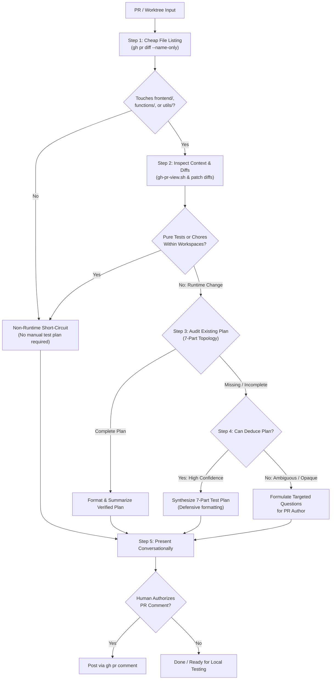

# Pull Request Experiment Test Plan Assistant (`pr-test-plan`)

This skill equips AI coding agents and human maintainers to evaluate incoming Pull Requests (or active feature worktrees) for participant and experimenter runtime changes, audit existing manual test instructions, and proactively synthesize Deliberate Lab's canonical **7-part manual experiment test plan**.

It bridges the gap between high-level code diffs and concrete local verification—eliminating the cognitive burden of reverse-engineering experiment configurations while maintaining strict testing discipline.

---

## When to use

Invoke this skill when:
- Reviewing an open PR: *"Does PR <id> need a test plan?"*, *"Evaluate PR <id> for testing"*, *"Review PR <id> test plan"*.
- Synthesizing verification steps: *"Draft a test plan for PR <id>"*, *"What manual test steps are needed for PR <id>?"*, *"Generate manual verification steps for this PR"*.
- Preparing to test locally: Pairing with [`eval-pr`](../eval-pr/SKILL.md) to understand how to configure and run an experiment before or after setting up a worktree.
- Authoring a PR: Creating a manual test plan for your own feature branch before opening a PR.

---

## Procedures



---

### Step 1 — Fast Short-Circuit on Touched Files (`--name-only`)

Start with an ultra-cheap listing of changed paths before pulling PR discussions, checks, or large diffs:

```sh
# Remote Pull Request
gh pr diff <number> --name-only

# Local Evaluation Worktree or Feature Branch
git diff origin/main...HEAD --name-only
```

#### Deterministic Short-Circuit Rule
Deliberate Lab runtime experiment software strictly lives in three npm workspaces ([Decision 0004](../../decisions/0004-repository-layer-taxonomy.md)):
- `frontend/` (participant & experimenter UX, stage components, MobX stores)
- `functions/` (Cloud Functions endpoints & Firestore triggers)
- `utils/` (stage definitions, data schemas, validation)

**If none of the changed files touch `frontend/`, `functions/`, or `utils/`** (e.g., changes strictly reside in `.agents/`, `.github/`, `docs/`, `scripts/`, `README.md`, or root configs):
1. **Stop immediately**.
2. Classify as **Non-Runtime** (`area:workspace`, `area:ci-deploy`, `area:git`, etc.).
3. Report to the user:
   > *"PR touches only non-runtime paths (`<file-list>`). No manual experiment test plan required."*

If any touched file is within `frontend/`, `functions/`, or `utils/`, proceed to Step 2.

---

### Step 2 — Inspect PR Context, Diffs & Classify Layer

Once confirmed that files touch runtime workspaces, inspect the full PR context and diffs:

#### Mode A: Remote Pull Request (Maintainer Triage)
1. **Inspect PR Overview & Description**:
   ```sh
   ./.agents/skills/gh/scripts/gh-pr-view.sh <number>
   ```
2. **Inspect Patch Diffs**:
   ```sh
   gh pr diff <number>
   ```

#### Mode B: Active Evaluation Worktree or Feature Branch
1. **Inspect Diffs**:
   ```sh
   git diff origin/main...HEAD
   ```
2. **Inspect Commits**:
   ```sh
   git log origin/main...HEAD --oneline
   ```

#### Layer Classification
Ground the change in Deliberate Lab's repository layers:

| Layer Category | Repository Layer | Typical Paths & Scopes | Manual Plan Required? |
| :--- | :--- | :--- | :--- |
| **Non-Runtime** | `area:test` | Standalone unit tests (`*.test.ts`) or mocks without runtime edits | ❌ No |
| **Non-Runtime** | `area:build` | Workspace `package.json`, `tsconfig.json`, linters, Prettier | ❌ No |
| **Runtime** | `runtime:participant-ux` | `frontend/src/components/stages/`, `frontend/src/components/participant/` | ✅ **Yes** |
| **Runtime** | `runtime:experimenter-ux`| `frontend/src/components/experimenter/`, dashboard, monitors | ✅ **Yes** |
| **Runtime** | `runtime:agents` | In-experiment LLM agents, mediator rules, prompts, personas | ✅ **Yes** |
| **Runtime** | `runtime:backend` | `functions/src/`, `utils/src/`, Firestore data models/triggers | ✅ **Yes** |

If the diff strictly modifies unit tests (`area:test`) or workspace build configs (`area:build`) without runtime logic changes, classify as **Non-Runtime**. Otherwise, proceed to Step 3.

---

### Step 3 — Audit Existing Plan Against the 7-Part Topology

Inspect the PR title, body description, and discussion comments. Evaluate whether the author provided manual verification instructions covering Deliberate Lab's canonical **7-part experiment topology**:

1. **Experiment Template**: Base experiment template or configuration to load (e.g., *Chat Negotiation*, *Group Discussion*, *Single-Player Survey*, or *Custom*).
2. **Stages Sequence**: Ordered sequence of stages to configure or navigate through (e.g., `InfoStage` ➔ `ProfileStage` ➔ `ChatStage` ➔ `SurveyStage`).
3. **Human Cohort**: Number of human participant sessions needed (e.g., *1 human tester*, *2 humans in separate incognito windows*).
4. **Agent Mediator**: Configuration of the LLM mediator bot, if involved (e.g., *None*, or *Default Mediator with standard prompt*).
5. **Agent Participants**: Automated LLM participant personas and count (e.g., *None*, or *2 LLM participants with default personas*).
6. **Tester Actions**: Clear, numbered step-by-step instructions for what the tester must click or input in the UI.
7. **Expected Behavior / Success Criteria**: Observable outcome, state change, or UI transition that confirms the feature or fix behaves correctly.

---

### Step 4 — Proactive Synthesis & Confidence Assessment

If a manual test plan is missing or lacks elements of the 7-part topology:

#### Scenario A: High Confidence Plan Synthesis (`canDeducePlan = true`)
When code diffs clearly map to specific stages, UI components, configuration flags, or participant journeys (e.g. adding minimum/maximum countdown timers to `InfoStageConfig`):
- Proactively reverse-engineer the code changes.
- Synthesize a complete, ready-to-run 7-part test plan.
- Use **defensive formatting**:
  - Keep numbered steps clean and sequential.
  - Indent sub-bullets with 3 spaces so GitHub Flavored Markdown preserves list nesting.
  - Avoid ambiguous jargon; state exact button labels and stage names.

#### Scenario B: Ambiguous or Opaque Changes (`canDeducePlan = false`)
When changes involve subtle backend data migrations, low-level concurrency locks, or private logic without evident UI manifestations:
- **Do not hallucinate or guess** a test plan.
- Explicitly explain why author guidance is required.
- Isolate the specific missing information (e.g. *"Diff modifies Firestore batching in `functions/src/` but does not indicate which participant action triggers this Cloud Function"*).

---

### Step 5 — Interactive Co-Authoring & Authorized Commenting

1. **Present the Determination in Conversation**:
   Present the classification and draft plan to the user in markdown.
2. **Review & Iterate**:
   Allow the user to tweak the steps, add custom experiment templates, or adjust cohort sizes.
3. **Authorized GitHub Comment (Optional)**:
   If—and **only if**—the developer explicitly directs you to post the comment to GitHub:
   ```sh
   gh pr comment <number> --body "<formatted-comment>"
   ```

---

## Safety Rules

- **No Autonomous Commenting**: Always gate `gh pr comment` behind explicit human approval in the conversation.
- **Lossless Reading**: When inspecting remote PR descriptions or diffs exceeding terminal limits, rely on the `gh` skill's temp file spillover pattern rather than risking truncated markdown.
- **Preserve Provenance**: Never alter or invent requirements beyond what the code diff directly demonstrates.
