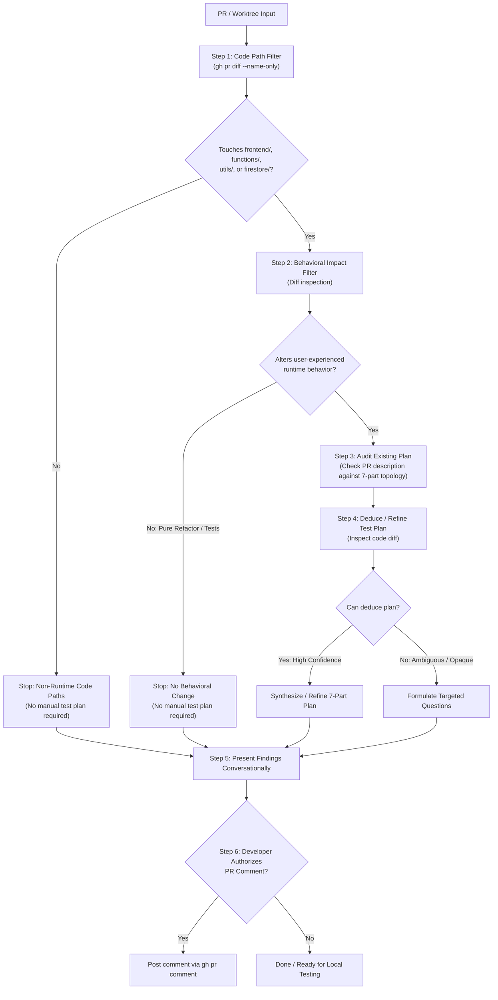

# Pull Request Experiment Test Plan Assistant (`pr-test-plan`)

This skill equips AI coding agents and human maintainers to evaluate incoming Pull Requests (or active feature worktrees) for participant and experimenter runtime changes, audit existing manual test instructions, and proactively synthesize Deliberate Lab's canonical **7-part manual experiment test plan**.

It bridges the gap between high-level code diffs and concrete local verification—eliminating the cognitive burden of reverse-engineering experiment configurations while maintaining strict testing discipline.

---

## When to use

Invoke this skill when:
- Reviewing an open PR: *"Does PR <id> need a test plan?"*, *"Evaluate PR <id> for testing"*, *"Review PR <id> test plan"*.
- Synthesizing verification steps: *"Draft a test plan for PR <id>"*, *"What manual test steps are needed for PR <id>?"*, *"Generate manual verification steps for this PR"*.
- Preparing to test locally: Pairing with [`eval-pr`](../eval-pr/SKILL.md) to understand how to configure and run an experiment before or after setting up a worktree.
- Authoring a PR: Creating a manual test plan for your own feature branch before opening a PR.

---

## Procedures



---

### Step 1 — Code Path Filter (Touches user-facing logic?)

Start with an ultra-cheap listing of changed file paths before inspecting diffs, discussions, or CI checks:

```sh
# Remote Pull Request
gh pr diff <number> --name-only

# Local Evaluation Worktree or Feature Branch
git diff origin/main...HEAD --name-only
```

#### Deterministic Code Path Heuristic
Deliberate Lab runtime experiment software lives in:
- `frontend/` (participant & experimenter UX, stage components, MobX stores)
- `functions/` (Cloud Functions endpoints & Firestore triggers)
- `utils/` (stage definitions, data schemas, validation)
- `firestore/` (Firestore security rules & indexes)

**If none of the changed files touch `frontend/`, `functions/`, `utils/`, or `firestore/`** (e.g., changes strictly reside in `.agents/`, `.github/`, `docs/`, `scripts/`, `README.md`, or root configs):
1. **Stop immediately**.
2. Report to the user:
   > *"PR touches only non-runtime paths (`<file-list>`). No manual experiment test plan required."*

If any touched file is within `frontend/`, `functions/`, `utils/`, or `firestore/`, proceed to Step 2.

---

### Step 2 — Behavioral Impact Filter (Alters user-experienced behavior?)

Once confirmed that changes touch runtime directories, inspect the diffs to determine if they actually produce an observable change in participant- or experimenter-experienced runtime behavior:

#### Inspecting Context & Diffs
```sh
# Remote Pull Request
./.agents/skills/gh/scripts/gh-pr-view.sh <number>
gh pr diff <number>

# Local Evaluation Worktree or Feature Branch
git diff origin/main...HEAD
git log origin/main...HEAD --oneline
```
*(Note: If operating inside a worktree where `./.agents` is not local, reference the container root `.agents/skills/gh/scripts/gh-pr-view.sh`.)*

#### Non-Behavioral Changes (Stop Condition)
If the changes fall into any of the following categories:
- **Pure Standalone Unit Tests / Mocks**: Changes strictly in `*.test.ts`, test fixtures, or test utilities without modifying production code.
- **Build & Lint Configs**: Modifications to workspace `package.json`, `tsconfig.json`, linters, or Prettier settings.
- **Pure Internal Refactoring**: Code reorganization, renaming, dead code elimination, or internal typing changes that preserve identical observable behavior and data structures.

**If no user-experienced behavior is changed:**
1. **Stop**.
2. Report to the user:
   > *"PR contains only non-behavioral changes (pure refactor, unit tests, or build configuration). No manual experiment test plan required."*

Otherwise (changes affect participant stages, experimenter dashboard controls, agent mediator/participant prompts, Cloud Functions endpoints, or Firestore triggers/rules), proceed to Step 3.

---

### Step 3 — Audit Existing Manual Test Steps

Inspect the PR title, body description, and discussion comments. Evaluate whether the author provided manual verification instructions and whether they are clear, complete, and accurate based on Deliberate Lab's canonical **7-part experiment topology**:

1. **Experiment Template**: Base experiment template or configuration to load (e.g., *Chat Negotiation*, *Group Discussion*, *Single-Player Survey*, or *Empty/Custom*).
2. **Stages Sequence**: Ordered sequence of stages to configure or navigate through (e.g., `InfoStage` ➔ `ProfileStage` ➔ `ChatStage` ➔ `SurveyStage`).
3. **Human Cohort**: Number of human participant sessions needed (e.g., *1 human tester*, *2 humans in separate incognito windows*).
4. **Agent Mediator**: Configuration of the LLM mediator bot, if involved (e.g., *None*, or *Default Mediator with standard prompt*).
5. **Agent Participants**: Automated LLM participant personas and count (e.g., *None*, or *2 LLM participants with default personas*).
6. **Tester Actions**: Clear, numbered step-by-step instructions for what the tester must click or input in the UI.
7. **Expected Behavior / Success Criteria**: Observable outcome, state change, or UI transition that confirms the feature or fix behaves correctly.

---

### Step 4 — Deduce or Refine the 7-Part Test Plan

Whether the PR already included a test plan or not, inspect the code diff to deduce or refine a ready-to-run 7-part test plan:

#### Scenario A: High Confidence Plan Synthesis (`canDeducePlan = true`)
When code diffs clearly map to specific stages, UI components, configuration flags, or participant journeys (e.g. adding countdown timers to `InfoStageConfig`):
- Proactively reverse-engineer the code changes into a complete 7-part test plan (or fill in any gaps from the author's existing plan).
- **Defensive Formatting**:
  - Keep numbered steps clean and sequential.
  - Indent sub-bullets with 3 spaces so GitHub Flavored Markdown preserves list nesting.
  - Avoid ambiguous jargon; cite exact stage names, form fields, and button labels.
- **Experimenter-Only Features**: If changes strictly affect the experimenter dashboard (e.g. CSV exports, session monitoring), specify the minimal experiment session (e.g. 1 participant) needed to populate data.

#### Scenario B: Ambiguous or Opaque Changes (`canDeducePlan = false`)
When changes involve subtle backend data migrations, low-level concurrency locks, or private logic without evident UI manifestations:
- **Do not hallucinate or guess** a test plan.
- Explicitly explain why author guidance is required.
- Isolate the specific missing information (e.g. *"Diff modifies Firestore batching in `functions/src/` but does not indicate which participant action triggers this Cloud Function"*).

---

### Step 5 — Present Findings Conversationally

Present the full evaluation to the developer in markdown:
1. **Behavioral Determination**: Whether runtime changes were detected and why.
2. **Audit of Author Instructions**: Summary of existing test steps in the PR (or note that none were provided).
3. **Canonical 7-Part Test Plan**: The complete, deduced verification walkthrough (or targeted questions if opaque).
4. **Ready for Verification**: Remind the user that these steps can be executed locally in `./run_locally.sh` (or paired with [`eval-pr`](../eval-pr/SKILL.md)).

---

### Step 6 — Offer Authorized GitHub PR Comment

Offer to post the formatted test plan as a comment on the GitHub PR:
- **Strict Authorization Gate**: Never post comments autonomously. Only run the command if the developer explicitly directs you to post:
  ```sh
  gh pr comment <number> --body "<formatted-comment>"
  ```

---

## Safety Rules

- **No Autonomous Commenting**: Always gate `gh pr comment` behind explicit human approval in the conversation.
- **Lossless Reading**: When inspecting remote PR descriptions or diffs exceeding terminal limits, rely on the `gh` skill's temp file spillover pattern rather than risking truncated markdown.
- **Preserve Provenance**: Never alter or invent requirements beyond what the code diff directly demonstrates.
