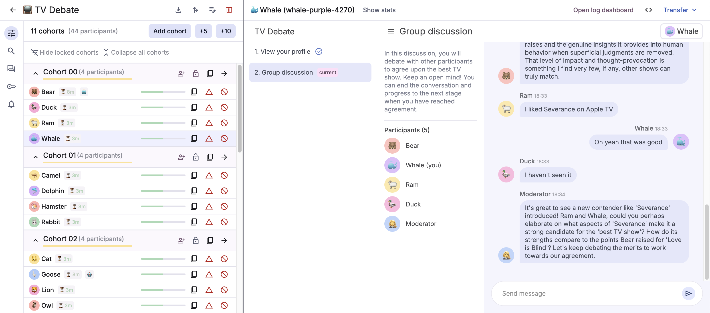

# Deliberate Lab

🕊️ **Deliberate Lab** is a platform for running online research experiments
on human + LLM group dynamics.



- 🔎 [Documentation for researchers + developers](https://pair-code.github.io/deliberate-lab/)
- 👉 [Quick start for developers](https://pair-code.github.io/deliberate-lab/developers/run-locally)
- :📃 [Technical paper](https://arxiv.org/abs/2510.13011)

## Citation

📝 If you use Deliberate Lab in your work, please include the following citation:

```
@misc{qian2025deliberatelab,
  author={Crystal Qian and Vivian Tsai and Michael Behr and Nada Hussein and Léo Laugier and Nithum Thain and Lucas Dixon},
  title={Deliberate Lab: A Platform for Real-Time Human-AI Social Experiments}, 
  url={https://arxiv.org/abs/2510.13011}, 
  year={2025},
}

```

See also `CITATION.cff` for citation file or "Cite this repository" in the GitHub sidebar for APA format.

## License and Disclaimer

All software is licensed under the Apache License, Version 2.0 (Apache 2.0).
You may not use this file except in compliance with the Apache 2.0 license.
You may obtain a copy of the Apache 2.0 license at:
https://www.apache.org/licenses/LICENSE-2.0.

Unless required by applicable law or agreed to in writing, all software and
materials distributed here under the Apache 2.0 licenses are distributed on an
"AS IS" BASIS, WITHOUT WARRANTIES OR CONDITIONS OF ANY KIND, either express or
implied. See the licenses for the specific language governing permissions and
limitations under those licenses.

This is not an official Google product.

Deliberate Lab is a research project under active development by a small
team. If you have suggestions or feedback, feel free to
[submit an issue](https://github.com/pair-code/deliberate-lab/issues).

Copyright 2024 DeepMind Technologies Limited.
