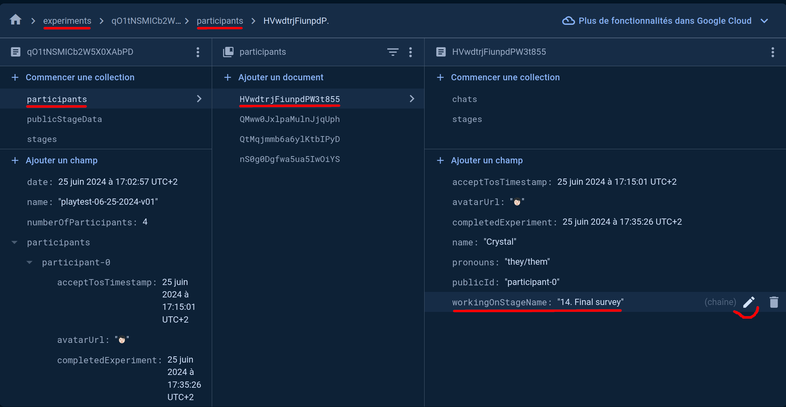
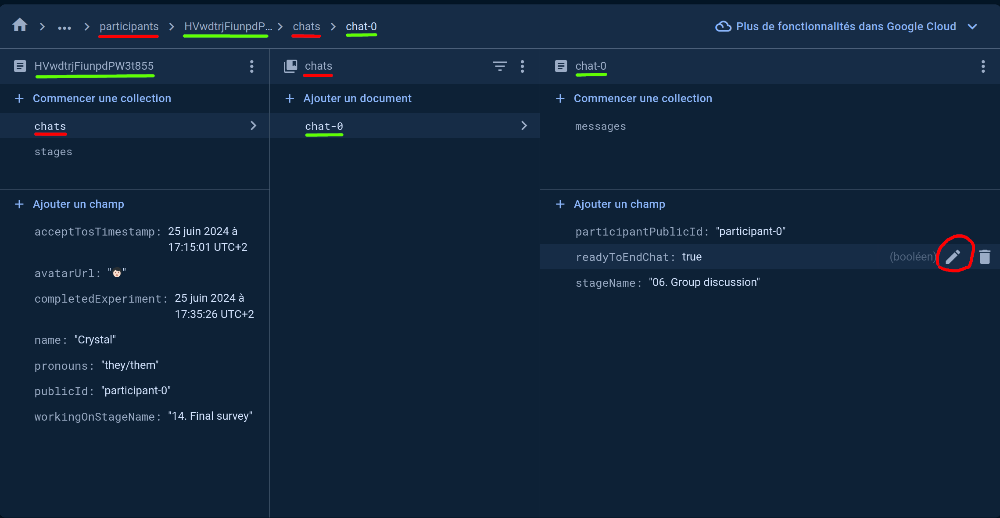
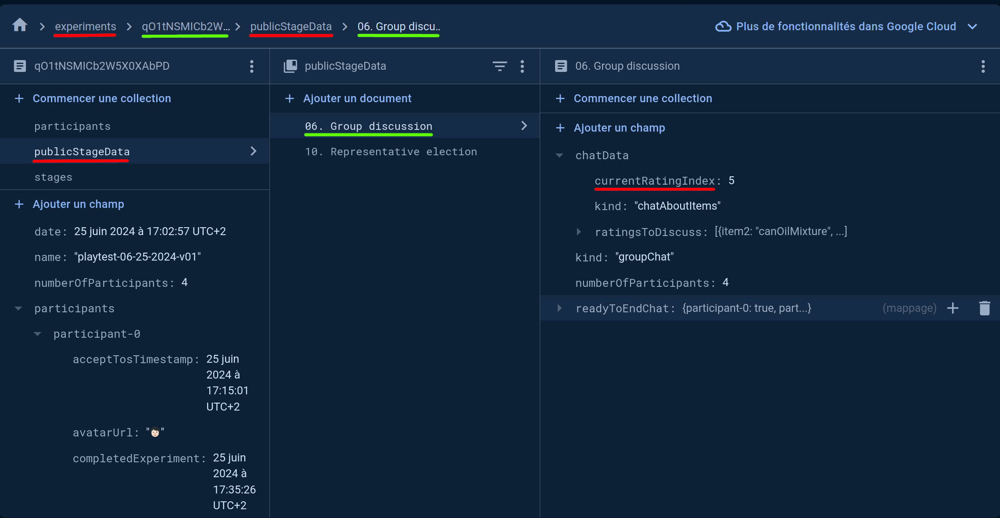

# Application Structure

## Firestore Database Schema

### Manual Stage Updates

You might need to manually unlock or advance participants while testing the application.
Here is how you can do it manually from the firestore console.

#### Advance stages

The `workingOnStageName` variable is stored in each participant's document (`/experiments/<experiment-id>/participants/<participant-id>`).
You can change it to any valid stage name in order to update a participant's progression.

#### Update Ready To End Chat

The `readyToEndChat` boolean for a specific participant and chat is stored in the participant's chat document (`/experiments/<experiment-id>/participaants/<participant-id>/chats/chat-<chat-index>`).
It is copied to the chat stage's public data by firestore triggers, which you should not update manually.

#### Update Discussed Item Pair

In the Lost at Sea chat module, you may want to advance or skip manually to next item pairs.
The discussed item pair index is stored in the chat stage's public data (`experiments/<experiment-id>/publicStageData/<stage-name>`).
Keep in mind that updating this value will NOT reset every participant's `readyToEndChat` stage.

## Lit Frontend

[See Lit frontend documentation](../lit/README.md)
