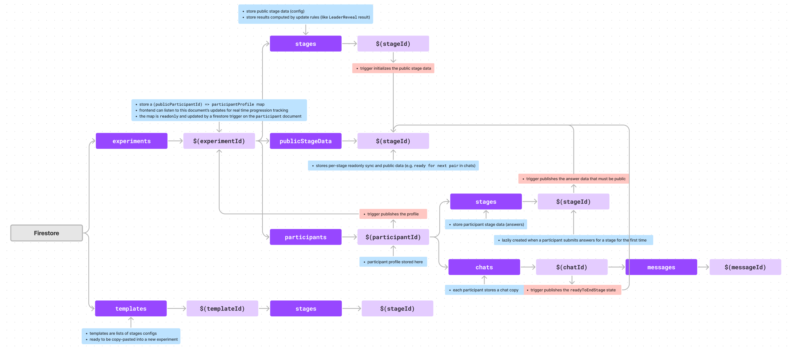

# Application Structure

Documentation of the webapp logic.

## Firestore Database Schema

## Repositories

The data layer of the webapp is managed by repositories. Repositories are defined in the [`repositories`](../webapp/src/lib/repositories/) folder, in files ending in `.repository.ts`.

Each repository class is responsible for fetching and updating data related to specific models. They expose data fetched via real time firestore subscriptions through angular signals.

- The [`BaseRepository`](../webapp/src/lib/repositories/base.repository.ts) class is a generic class that lays the foundation for firestore-subscription-based repositories.
- The [`ExperimentRepository`](../webapp/src/lib/repositories/experiment.repository.ts) handles the data under the `experiment` collection, except for the `participants` subcollection.
- The [`ParticipantRepository`](../webapp/src/lib/repositories/participant.repository.ts) handles the data under the `participants` subcollection of an experiment, except for the `chats` subcollection.
- The [`ChatRepository`](../webapp/src/lib/repositories/chat.repository.ts) handles the data under the `chats` subcollection of a participant.
- The [`ExperimenterRepository`](../webapp/src/lib/repositories/experimenter.repository.ts) is a singleton class that handles generic experimenter-related data.

## AppState

Individual repository instances are owned and provided by a singleton [`AppState`](../webapp/src/app/services/app-state.service.ts) service injected at the app root.
It stores lazy maps of repositories, which are created on demand when a repository is requested for the first time. This service can be injected into any component or service to access the repositories.

## Participant Service

For participant-specific data, a helper [`ParticipantService`](../webapp/src/app/services/participant.service.ts) is provided.
It aggregates experiment and participant repository data for a specific participant, and provides convenient methods and signals to access and update this data.
One instance of this service is created at the [participant root page](../webapp/src/app/participant-view/participant-view.component.ts), and bound to experiment ID, participant ID and stage names stored in the URL.

## Cloud functions & Firestore

For simple data updates, the webapp connects directly to firestore. Validation is handled with [firestore rules](../firestore/firestore.rules).
For more complex operations, the webapp calls cloud functions. These functions are defined in the [`function endpoint`](../functions/src/endpoints) folder,
and use the `@sinclair/typebox` library for data validation.

Cloud functions are also used as triggers to copy data around the firestore database for convenience and ACL reasons.
