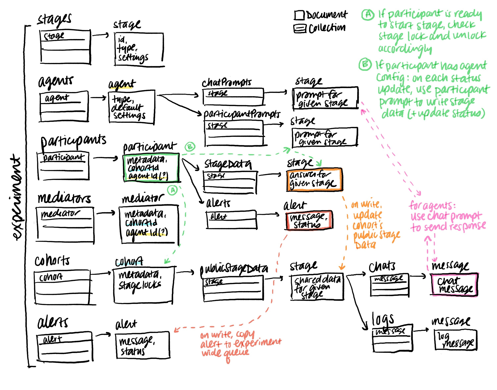

  ⚠️ Documentation may be out-of-date

## Overview

Deliberate Lab uses Firebase's [Cloud Firestore database](https://firebase.google.com/docs/firestore/),
which is comprised of collections of documents (where each document
can contain collections, each of those collections contain documents, and
so on).

The following diagram shows all the collections/documents under an "Experiment"
document:

The frontend can fetch and/or listen to specific collections or documents.

> Example: A listener for `$EXPERIMENT_ID/cohorts/$COHORT_ID/publicStageData/$STAGE_ID/chats/`
could show all the chat messages available in a specific stage for a specific
experiment cohort.

On the backend, Cloud functions are used to update documents and sometimes
trigger relevant updates to other documents.

> Example: If updating a participant
answer, the function would write the new version of the participant's `$STAGE_ID`
answer to `$EXPERIMENT_ID/participants/$PARTICIPANT_ID/stageData/$STAGE_ID`.

> Writing to this path will trigger a different Cloud function that, if the
stage type is relevant, updates the participant's current cohort's public stage
data for `$STAGE_ID`. That means that when a participant completes a ranking
of other participants, their answer triggers an update to their cohort's
public ranking data, i.e., the calculation of the "winner" (highest ranked participant).

For details on how agents automatically interact with experiments and send
chat messages, see [Agent design](agent-design).

## Directories

### /utils

Utils are organized by stage (under `/utils/src/stages`). Each stage has:

- Main file (e.g., `survey_stage.ts`) defining relevant types and functions,
(e.g., stage, stage's participant answer, and stage's public data)

- Validation file (e.g., `survey_stage.validation.ts`) defining type
checks that are used by Firebase cloud functions (and their frontend endpoints)

### /functions

Firebase Cloud functions are organized by the object
(e.g., participant, survey stage) that they update.

### /frontend

The frontend web app includes:

- `pair-components`: UI components including buttons, tooltips
- `components`: Core platform components organized by directory, notably:
  - `experiment_builder`: Interface for creating/editing experiments
  - `experiment_manager`: Dashboard for managing experiment cohorts and participants
  - `participant_previewer`: Stage et al. screens viewed by experiment participants
- `services`: MobX services managing state. Services ending in `service.ts`
run for all users (both researchers and participants); `experiment.editor.ts` is used
to locally assemble an experiment before writing to Firestore; and `experiment.manager.ts`
is used for the experiment management dashboard (visible when researchers click
on an experiment)
