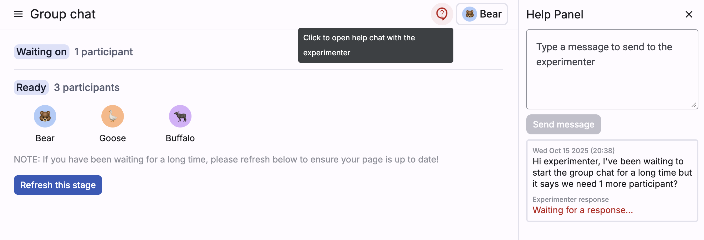
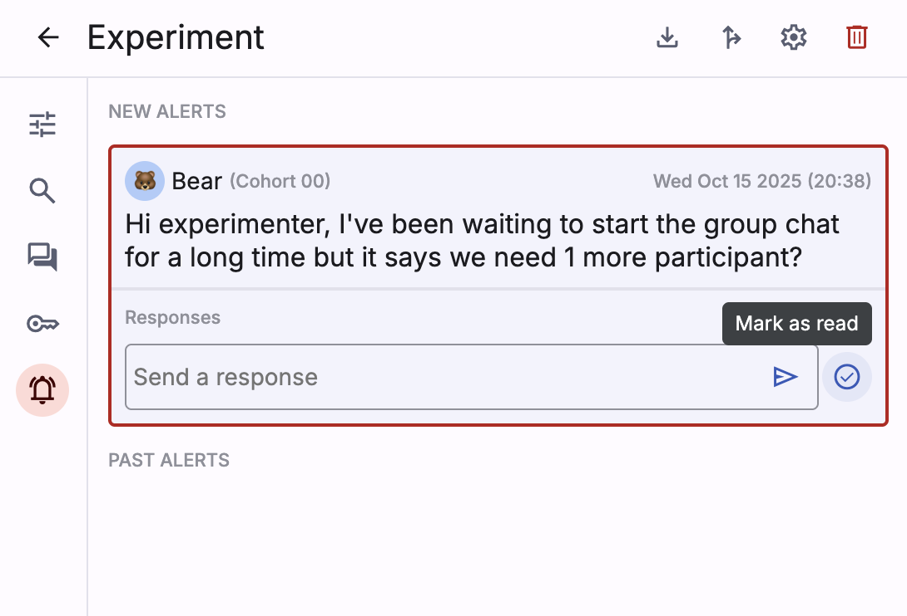

The **help/alert panel** feature enables participants to send alerts to
experimenters inside Deliberate Lab and experimenters to receive and respond
to those alerts.

## User journey

### Participant view
Participants will see a help chat icon at the top right of their screen;
clicking this will open a right-side panel where they can type and send
a custom message.

Each sent message in the panel will show the experimenter's response
once available (or, if the experimenter reviews but does not respond to the
message, a read receipt).

### Experimenter view
In the experiment dashboard, experimenters will see an alert tab on the
left side. The alert icon will change to a red, "active notification" style
if there are new messages to review.

Once in the alert tab, experimenters can send a custom response to the
participant, or just click to mark the message as "read" (which will then
show a read receipt to the participant).

After a messagae is marked as read or responded to, it will appear under
"Past Alerts." Note that experimenters can send multiple responses to the
same message.

## Implementation

### Definitions in /utils
The `AlertMessage` item is set up (under `/utils/src/alert.ts`)
to consist of a single message from a participant, a list of responses
from the experimenter(s), and a status (e.g., whether or not message was marked
as read by the experimenter).

We also capture experiment ID, participant ID, and the participant's
current cohort and stage at the time the message was sent.

> Note: To make alert message threads more of a chat back-and-forth (e.g.,
both parties can send multiple messages), we might consider restructuring
alerts to work more like chat threads (distinct messages for everything,
including experimenter responses, but with a `discussionId` field to help
bundle messages into threads).

### Endpoints in /functions
The following exist under `/functions/src/alert.endpoints.ts`:

- `sendAlertMessage`: called by participants when writing a new alert message;
  this writes the AlertMessage as a document under the participant (so that
  the participant can see only their alert messages) and writes
  a copy under the experiment (so that it's easy for experimenters to
  fetch all alerts from all participants at the experiment level)

- `ackAlertMessage`: called by experimenters when responding; this fetches
  an existing alert message by ID, updates its status and responses, and
  re-writes it to both the participant-level and experiment-level paths

> TODO: Logic for both endpoints should be cleaned up so that the
experiment-level alerts are updated via trigger function
(for the participant-level alert path).

### UI components in /frontend
- The `participant_help_panel` (under the `participant_view` directory)
  renders the right-side help panel and the participant's view of their alerts
  using a snapshot listener for participant-level alerts located in
  `ParticipantService`
- The `experimenter_panel` renders the alert panel in the experiment
  dashboard and uses a snapshot listener for experiment-level alerts
  located in `ExperimentManagerService`

Future improvements on the experimenter side might include:

- Collapse/hide alerts (and/or response text box) in the experimenter view
- Mark alerts as "resolved" (right now the experimenter can only mark "read")
- Group alert messages by participant

## Data download
We fetch the alerts from the experiment-level collection (this is stored
in the `ExperimentDownload` object) and use this to create a CSV where
each row is an AlertMessage.
