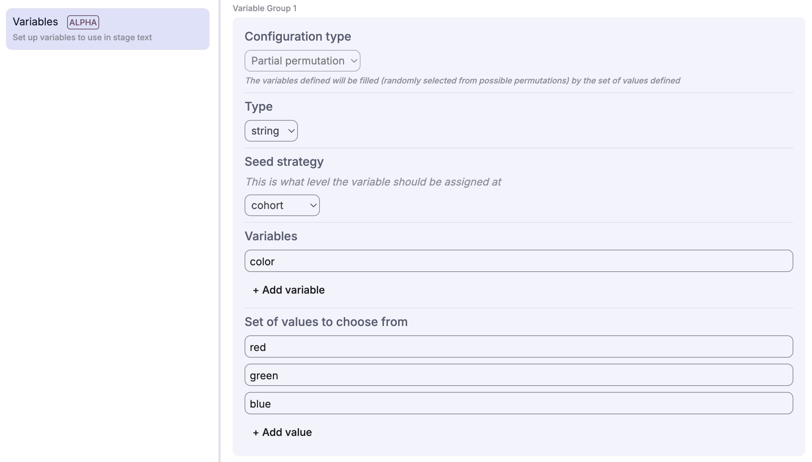

> Note: This is an alpha feature and is not currently compatible with
agent mediators or agent participants

## Experimenter setup
Deliberate Lab offers variable support within experiments.
Variable configs can be defined in the experiment builder; experimenters can
specify:
- A **schema** defining the variable structure (primitives, objects, or arrays)
- A **scope** defining when the variable is assigned:
  - **Experiment (Global):** Value is constant for the entire experiment.
  - **Cohort:** Value is assigned when a cohort is created (shared by all participants in that cohort).
  - **Participant:** Value is assigned when a participant joins (unique to that participant, or independently shuffled).
- A set of **variable names** to be populated
- A set of **values** to choose from (as JSON strings)

For **Random Permutation** variables, values are randomly selected from the pool based on the scope (e.g., a Cohort-scoped variable is randomized once per cohort).

> Support for other config types, such as populating variables based on a
weight distribution of values or manually assigning values when creating
a cohort, to be added eventually.



### Variable Naming Rules

Variable and property names can only contain:
- Letters (a-z, A-Z)
- Numbers (0-9)
- Underscores (_)

Names cannot start with a number. This prevents conflicts with Mustache template syntax where dots (`.`) are used for path access (e.g., `{{obj.field}}`).

The variables use
[Mustache templating](https://mustache.github.io/mustache.5.html)
and are supported in the
following locations:

- Stage descriptions (primary text, info text)
- Info stages (info lines)
- Multi asset allocation stages (stock name and description)

### Variable Schemas

Variables use **JSON Schema** (via [TypeBox](https://github.com/sinclairzx81/typebox)) to define their structure. This provides runtime validation and type safety.

#### Primitive Types

```typescript
// String variable
schema: VariableType.STRING

// Number variable
schema: VariableType.NUMBER

// Boolean variable
schema: VariableType.BOOLEAN
```

#### Object Types

For structured data with named fields:

```typescript
schema: VariableType.object({
  name: VariableType.STRING,
  age: VariableType.NUMBER,
  active: VariableType.BOOLEAN,
})
```

Template usage: `{{person.name}}`, `{{person.age}}`

#### Array Types

**Arrays of primitives:**

```typescript
// Array of strings
schema: VariableType.array(VariableType.STRING)

// Array of numbers
schema: VariableType.array(VariableType.NUMBER)
```

Template usage: `{{colors.0}}`, `{{colors.1}}`

**Arrays of objects:**

```typescript
schema: VariableType.array(
  VariableType.object({
    title: VariableType.STRING,
    text: VariableType.STRING,
  })
)
```

Template usage: `{{arguments.0.title}}`, `{{arguments.1.text}}`

### Expanding Arrays to Separate Variables

For **Random Permutation** variables, you can choose to expand an array into individual indexed variables. This is controlled by the **"Expand to separate variables"** option (enabled by default).

**When enabled (`expandListToSeparateVariables: true`):**
- Creates separate variables: `charity_1`, `charity_2`, `charity_3`, etc.
- Each variable holds a single value from the array
- Template usage: `{{charity_1}}`, `{{charity_2}}`

**When disabled (`expandListToSeparateVariables: false`):**
- Creates a single array variable: `charity`
- Template usage: `{{charity.0}}`, `{{charity.1}}` or iteration with `{{#charity}}...{{/charity}}`

This is useful when you want predictable variable names for a fixed number of items (e.g., always showing exactly 3 charities) rather than working with array indices.

### Nested Structures

Schemas can be nested arbitrarily:

```typescript
schema: VariableType.object({
  policy: VariableType.STRING,
  arguments_pro: VariableType.array(
    VariableType.object({
      title: VariableType.STRING,
      text: VariableType.STRING,
    })
  ),
  arguments_con: VariableType.array(
    VariableType.object({
      title: VariableType.STRING,
      text: VariableType.STRING,
    })
  ),
})
```

### Validation

Variables are validated at multiple points:
- **In the variable editor:** Values are validated against schemas as you type, with errors shown inline.
- **In the experiment builder:** Template references are checked for missing variables (referenced but not defined) and unused variables (defined but never referenced).
- **When creating cohorts/participants:** Values are validated when `generateVariablesForScope()` assigns them. Validation errors are logged as warnings.

See the [Implementation](#schema-validation) section for details.

## Implementation

### Schema Definition (`utils/src/variables.ts`)

Variables use TypeBox to create JSON Schema objects:

```typescript
export namespace VariableType {
  export const STRING = Type.String();
  export const NUMBER = Type.Number();
  export const BOOLEAN = Type.Boolean();
  export const object = (properties: Record<string, TSchema>) =>
    Type.Object(properties);
  export const array = (items: TSchema) =>
    Type.Array(items);
}
```

Each `VariableConfig` contains:
- `definition`: The `VariableDefinition` (name, description, schema).
- `type`: The type of config (e.g., `STATIC`, `RANDOM_PERMUTATION`).
- `scope`: The scope of assignment (`EXPERIMENT`, `COHORT`, `PARTICIPANT`).

### Schema Validation

Validation uses TypeBox schemas with [Ajv](https://ajv.js.org/) as the underlying validator. Validation occurs at these points:

1. **In the variable editor** (design-time): As you edit variable values, the UI validates them against the schema and shows errors inline (`validateVariableValue()` in `variables.utils.ts`).

2. **When cohorts/participants are created** (runtime): Values are validated when `generateVariablesForScope()` assigns values. Validation errors are logged as warnings but don't block creation (`validateParsedVariableValue()` in `variables.utils.ts`).

> Note: TypeBox schemas in `variables.validation.ts` are used for TypeScript type checking but not for runtime API validation of experiment saves.

### Value Assignments

When experiments, cohorts, and participants are created (in `functions/`),
the variable configs (from the experiment config) are used to assign relevant
values to a `variableMap` on the respective object (Experiment, Cohort, or Participant).

The backend utility `generateVariablesForScope` (`utils/src/variables.utils.ts`)
filters the configs based on the current scope being created (e.g., only processing
`COHORT` scoped variables when creating a cohort). Values are then generated
(e.g., selecting a random permutation) and stored as JSON strings.

For **Random Permutation** variables with `expandListToSeparateVariables` enabled:
- Multiple variables are created: `name_1`, `name_2`, etc.
- Each variable holds a single item from the selected array
- The `numToSelect` option controls how many items are selected (validated to be within `[1, values.length]`)

Values are type-coerced based on the schema:
- `string`: Used directly
- `number`/`integer`: Parsed from string
- `boolean`: Converted from 'true'/'false' strings
- `object`/`array`: Parsed from JSON strings

(Note that cohort and participant variable value assignment can be verified
in the experiment dashboard via the displayed JSON configs.)

### Template Resolution (`utils/src/variables.template.ts`)

When stages are rendered in the participant view (and for the reveal stage),
the stage config is passed through a `StageHandler` function that
runs specified fields through template resolution.

**Template validation:**
- Extracts all variable references from Mustache templates
- Validates each reference against the schema
- For nested paths (e.g., `{{policy.arguments_pro.0.title}}`):
  - Navigates through object `properties`
  - Navigates through array `items` schemas
  - Skips numeric array indices
  - Validates field existence at each level

**Editor validation:**
The experiment builder validates templates and shows warnings for:
- Missing variables (referenced in templates but not defined)
- Unused variables (defined but never referenced in any stage)

**Template rendering:**
- Type-coerces values based on schema type
- Uses Mustache.js for template rendering
- Supports nested object/array access with dot notation

In the base class `StageHandler`, the stage's description (primary text, info
text) fields are resolved (extended classes are encouraged to extend this
functionality).

> NOTE: Not all stages have been migrated to the stage manager/handler setup.

## Roadmap / Future Work

The following areas are planned for future integration with Variables:

- [ ] **Prompts:** Support variable interpolation in LLM prompts (e.g., `{{policy.title}}` in a mediator's system instructions).
- [ ] **Flipcards:** Support variables in flipcard content (e.g., shuffling arguments onto cards).
- [ ] **Surveys:** Support variables in survey question text and choices (e.g., "How did you feel about {{charity_name}}?").
- [ ] **Agent Mediators:** Ensure mediators have full visibility into participant-specific variables (context awareness).
