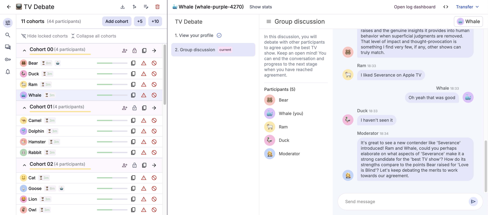

## Information

> [Log into the Google-hosted platform](https://deliberate-lab.appspot.com/){:target="_blank"}
(or [request access here](https://forms.gle/VCmYQxsZWEA3mbZN6){:target="_blank"})

- [GitHub repository](https://github.com/PAIR-code/deliberate-lab/){:target="_blank"}
- [Contributing](contributing.md){:target="_blank"}
- [Code of Conduct](code-of-conduct.md){:target="_blank"}

## Contact
Questions about using, customizing, or contributing to Deliberate Lab?

- Email llm-mediation-core@google.com
- [Sign up for office hours](https://calendar.google.com/calendar/u/0/appointments/schedules/AcZssZ1vnXTzLbG5csiPLKpZvqO_XvRXZfKnQ3R_D0frPNOlCSz0EDAY3sjVV0azWNkPrTfeg9qCLSIw){:target="_blank"}
- [File issues and feature requests on GitHub](https://github.com/PAIR-code/deliberate-lab/issues/new){:target="_blank"}

## Citation

**Please cite Deliberate Lab if you use it in your work!**
[See GitHub repository sidebar](https://github.com/PAIR-code/deliberate-lab/){:target="_blank"}
for the latest citation file.
