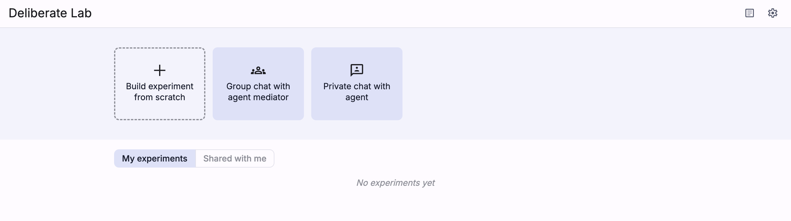
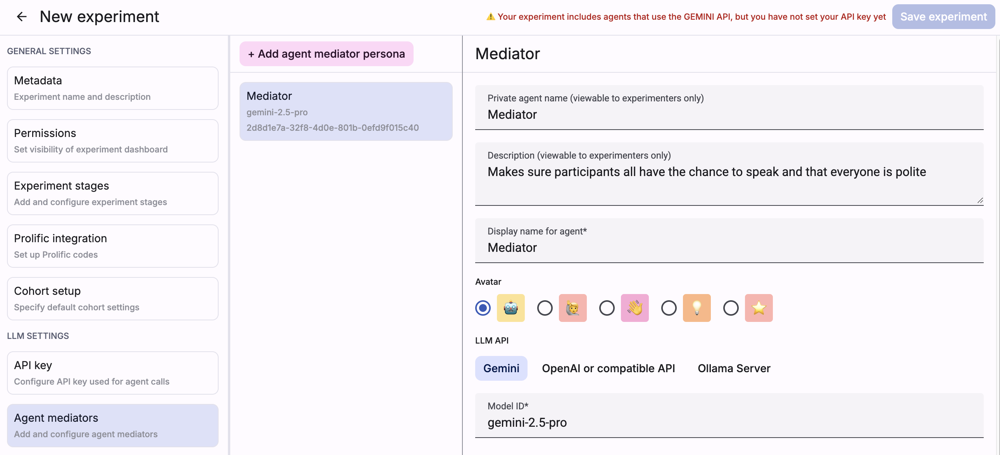
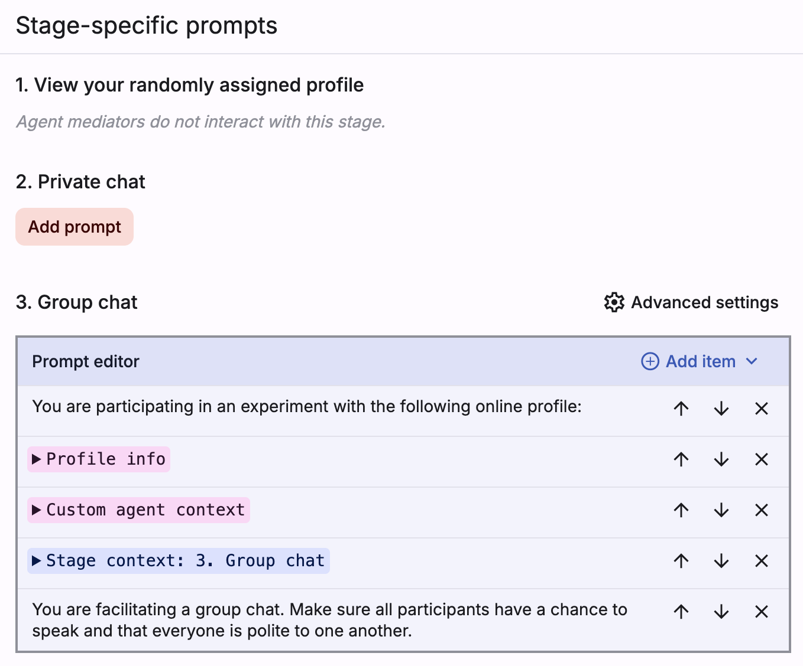

When configuring your experiment, make sure you have a group or private
chat set up (you can use the cards at the top of the home page
to quickly create a chat-based experiment).

Then, navigate to the "Agent mediators" tab and set up a persona for your
mediator.

> ⚠️ Make sure you have an API key set for the API that your
mediator will use!

Below persona settings such as display name and API/model, you'll
see a list of stage-specific prompts. Make sure that you have prompts
added to the stages where your mediator will be active.

Use the "Automatically add this mediator to every cohort" toggle if you
want new cohorts to include the mediator by default. Leave it off when you
prefer to add the mediator manually from the experiment dashboard for
specific cohorts only.

Note that in the prompt editor, "stage context" includes everything
the participant will see in that stage (e.g., for chat stages, chat
history and list of chat participants).