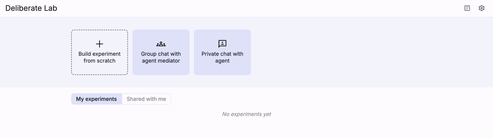

## Build experiment
To create a new experiment, click on one of the options at the top
of the home page.

After setting up the experiment stages and settings, use the button in the top
right corner to save your experiment. This will make it available
from the home page gallery.

## Edit or fork experiment
To edit an experiment, click on its card in the home page gallery.

<!-- TODO: Add screenshot -->

At the top left of the experiment dashboard, fork or
view/edit settings for the current experiment.

For creators: general
experiment configurations (e.g., metadata, permissions, delete experiment)
can be edited at any time, but stages can only be adjusted if no cohorts
currently exist in the experiment.

Non-creators cannot edit the experiment metadata/stages, but they
can click the top left settings icon to preview the configurations.

## Preview experiment

> Coming soon: Simplified workflow for previewing an experiment

To preview or test your experiment, create a new cohort and add
a participant, then use the "participant preview" panel (or copy that
participant's experiment link) to see the participant's view.
Once you're done, delete the cohort to enable editing experiment stages.