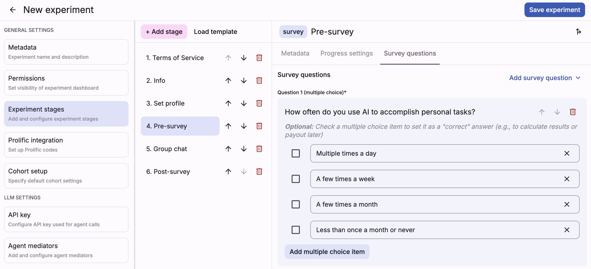

Welcome to Deliberate Lab! To get started, you should have a website
link to the platform. If you're using the Google-hosted platform,
[go here](https://deliberate-lab.appspot.com/).

> If you're setting up your own deployment of the platform,
see the Developers section in the sidebar.

## Overview

> A quick overview of concepts/terms referenced across the platform
and this documentation

In Deliberation Lab, experimenters can create `experiments`, which are
comprised of an ordered set of `stages`.
Each stage can be configured to include custom content and options.

While setting up your experiment, you can also adjust settings for
visibility, Prolific integration, etc.

### Cohorts

While running an experiment, experimenters can create `cohorts`, which is a
bundle of participants who can interact with each other during the experiment.

> Example: if running an experiment where people engage in a group chat,
you might create 10 cohorts in order to have 10 separate group chats.
All data can be downloaded together at the experiment (top) level.

Participants can be manually added to cohorts (via experimenter
dashboard), or they can dynamically join from a cohort landing URL.

Experimenters have the ability to transfer participants to different cohorts
(within the same experiment) or "boot" (kick out) participants from
the cohort/experiment.

## Logging in

Navigate to your provided website link and use the "Experimenter login"
button to log in via Google account.

> If you're using the Google-hosted platform,
[go here](https://deliberate-lab.appspot.com/).

Anyone with a Google account can "log in" to the platform, but researchers
must be on an "allowlist" (managed in Firebase datastore) to view, create, and
manage experiments.

> If you receive a `403: Participants do not have access`
error, you have not been added to the allowlist and should contact
the person hosting the platform (at the website link you were provided).

Once you're logged in, you should be able to see a home page with
both your experiments and any shared public experiments.

> Tip: If you plan to set up LLM mediators, add relevant API keys
(e.g., [Gemini API key](https://ai.google.dev/gemini-api/docs/api-key))
on the Settings page now. Your key must be present in order to effectively
run LLM agents during experiments. We store it in a Firebase document
that only you (and the backend function making the LLM calls
for your experiment) can access.

## Next steps
Once you have access to the platform, you can start creating and running
your experiments!