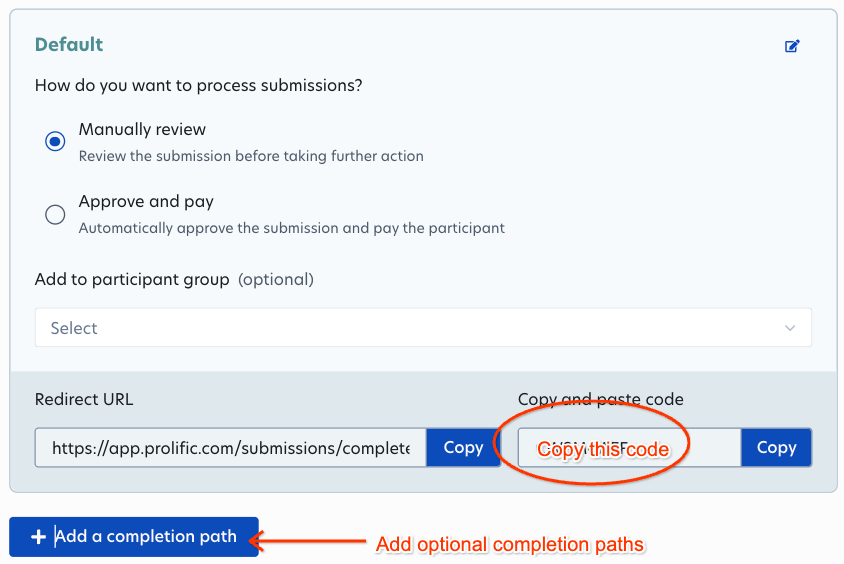
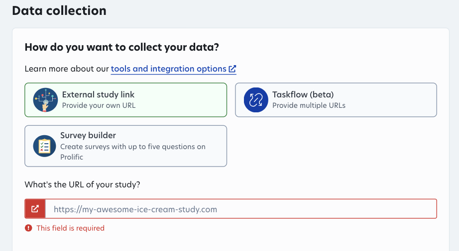

You can use Prolific to recruit participants for your Deliberate Lab
experiment.

## Add Prolific redirect codes to Deliberate Lab

First, when setting up your experiment, click "Enable integration with
Prolific".

Copy your redirect code(s) from the Prolific platform and paste into the
Deliberate Lab field(s).

The default completion code is required; you can optionally add redirect codes
for failed attention checks or blocked participants.
These help manage participants in Prolific.

## Add Deliberate Lab link to Prolific

After creating your experiment, create a cohort and copy the link.
Paste this link into your Prolific experiment:

Participants will be redirected to Prolific after completing or being booted
from your experiment.