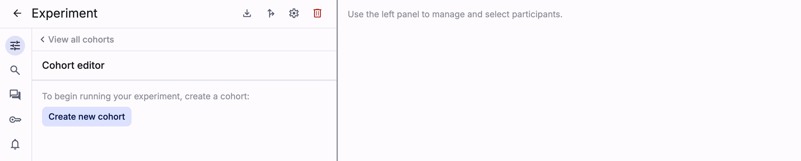
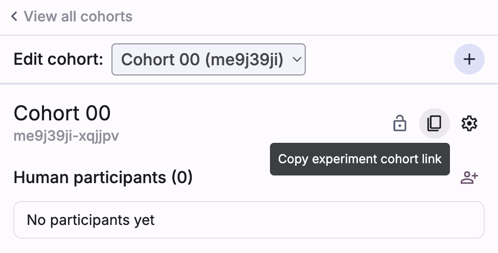
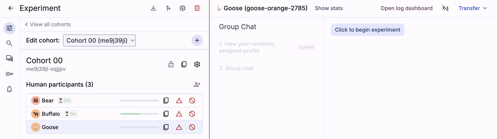
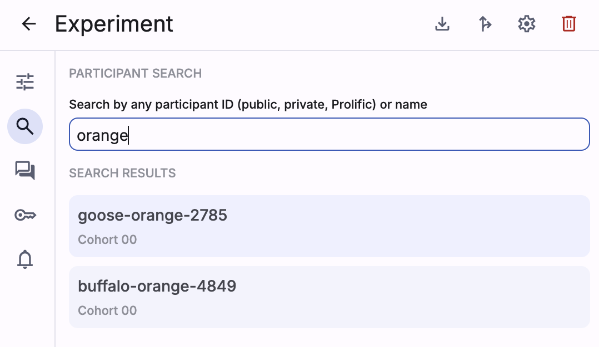

## Set up cohort(s)
Navigate to the experiment and use the cohort panel's "Create new cohort"
button to create new cohorts.

Once a cohort is created, use the buttons to:
- Directly add participants (and copy/share their experiment links)
- Copy and share the "join cohort" link (which allows participants to
dynamically join the cohort)
- Lock/unlock the cohort (preventing/enabling participants from joining)
- Edit cohort settings (including giving the cohort a custom name and description in the dashboard)
- Add an agent mediator persona to the cohort if you did not enable automatic
  mediator enrollment when configuring the persona

To delete a cohort, use the settings icon in the cohort toolbar. Note that
deleting a cohort also deletes all its participants.

## Manage participants
As participants join the experiment, they'll appear in the
experiment dashboard under the cohort list panel.

Click on a specific participant and (in the general dashboard settings tab
on the left) toggle participant panels to view that participant's status and/or
act on their behalf.

### Search for participants
Use the search tab (on the left) to search for a specific participant
by any of their ID names (and then click on the search result to select them
in the cohort list).

### Send attention check
Use the "attention check" button to send a popup to a participant (asking them
if they are still present in the experiment). If an attention check has been
sent, an "attention check" status chip will appear next to the participant's
name in the cohort list panel. Once the participant resolves the popup,
this status chip will disappear.

### Boot participants
Use the "boot" button to manually remove participants from their cohort and
experiment.

<!-- TODO: Add screenshot -->

### Transfer participants
After clicking on a specific participant, use the "Transfer" dropdown
at the top of the right panel to transfer that participant to a different
cohort.

The participant will visually be sorted under the new cohort, but they
must explicitly click to "accept transfer" in order to become active
in the new experiment.

<!-- TODO: Add screenshot -->

> Note: If a participant is currently in a "Transfer" experiment stage,
a "Ready for transfer" status chip will appear in the left cohort panel.

